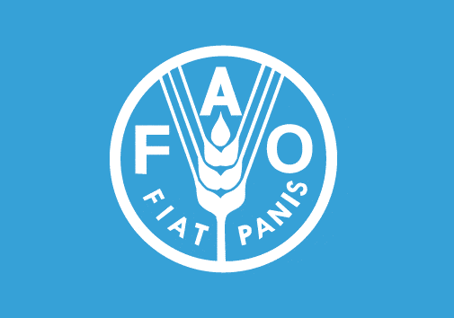

# Welcome to the FAO GitHub!
Bienvenue! Bienvenido! 欢迎! Добро пожаловать! مرحباً!

Welcome to the official public GitHub account of the Food and Agriculture Organization of the United Nations (FAO).

FAO leads international efforts to defeat hunger and achieve food security for all. Our core mission is to support the transformation to MORE efficient, inclusive, resilient, and sustainable agrifood systems for better production, better nutrition, better environment, and a better life, leaving no one behind.

We invite you to explore our repositories. Here you'll find projects ranging from data analysis tools and information systems to mobile applications and modeling frameworks, all developed by dedicated teams within FAO to support our mandate.

## Learn More:

To learn more about the Food and Agriculture Organization of the United Nations and our global efforts, please visit our main website: [https://www.fao.org](https://www.fao.org)

## Contact Us:

For inquiries or additional information about our projects, reach out at:
**Email:** [sdlc-support-list@fao.org](mailto:sdlc-support-list@fao.org)

Thank you for visiting!
